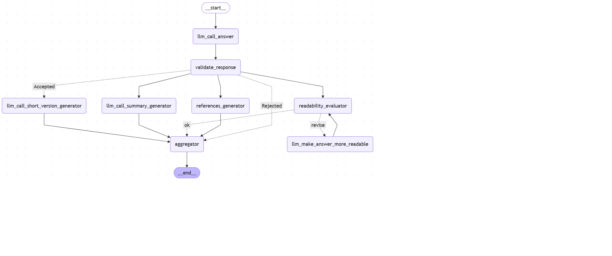

# Llama Index Server Application

This server application integrates AzureOpenAI's models for language processing. 
It utilizes the LlamaIndex and LangChain libraries for managing vector storage and retrieval, offering an interface for chat-like interactions.
This application serves as a demonstrative example to test the capabilities of:
- Retrieval-Augmented Generation (RAG) using Llama Index and AzureOpenAI. 
- and Agent for orchestring a workfow that analyse the query and goes through several steps for constructing an answer

It has been developed by HELSEDIREKTORATET (the Norwegian Directorate of Health) as part of the 'HelseSvar' project.


## Features

- Utilizes AzureOpenAI's models for advanced language understanding.
- Stores and retrieves text data using the Llama Index library.
- Allows querying of stored data with a natural language interface.
- Supports context-aware responses based on the indexed data.
- it uses the  LlamaIndex and LangChain

## Setup

Before running the application, ensure you have Python3.8 or newwer installed along with Quart and other required libraries.
Download and install from https://www.python.org/downloads/.
You will need to create an Azure OpenAI Service resource that gives you access to a model with a key, modelname, version, endpoint, ...

### Installation

1. Clone the repository to your local machine.
2. Install required Python packages:

    ```bash
    pip install -r requirements.txt

### Configuration

1. Create a .env file in the root directory of the project with the following content (replace the placeholders with your actual API keys):
.env
Put your Azure/OpenAI keys and any other secrets here. You will need:
AZURE_OPENAI_MODEL=xx
AZURE_OPENAI_DEPLOYMENT_NAME=xx
AZURE_OPENAI_API_KEY=xx
AZURE_OPENAI_AZURE_ENDPOINT=xx
AZURE_OPENAI_API_VERSJON=xx
OPENAI_API_KEY=xx


2. Data Indexing
The application requires indexed data to function correctly.
Specify the data source directory and the storage directory for indexing.
The application currently indexes data from ./blobstorage/chatbot/helsenorgeartikler
The vector index consist of 1000 pages for articles form Helsenorge.no about health:
https://www.helsenorge.no/gravid/
 https://www.helsenorge.no/fodsel/
 https://www.helsenorge.no/etter-fodsel/
 https://www.helsenorge.no/ufrivillig-barnloshet/
 https://www.helsenorge.no/spedbarn/
 https://www.helsenorge.no/alkohol/
 https://www.helsenorge.no/kosthold-og-ernaring/
 https://www.helsenorge.no/rus-og-avhengighet
 https://www.helsenorge.no/sex-og-samliv/
 https://www.helsenorge.no/snus-og-roykeslutt/
 https://www.helsenorge.no/sovnproblemer
 https://www.helsenorge.no/trening-og-fysisk-aktivitet/
 https://www.helsenorge.no/vaksinasjon/
 https://www.helsenorge.no/undersokelse-og-behandling/langvarige-smerter/
 https://www.helsenorge.no/forstehjelp/
 https://www.helsenorge.no/giftinformasjon/
 https://www.helsenorge.no/kliniske-studier/
 https://www.helsenorge.no/medisiner/
 https://www.helsenorge.no/undersokelse-og-behandling/
 https://www.helsenorge.no/sykdom/astma-og-allergi/
 https://www.helsenorge.no/sykdom/hjerte-og-kar
 https://www.helsenorge.no/sykdom/diabetes
 https://www.helsenorge.no/sykdom/koronavirus
 https://www.helsenorge.no/sykdom/kjonnssykdommer
 https://www.helsenorge.no/sykdom/kreft
 https://www.helsenorge.no/sykdom/lunger-og-luftveier
 https://www.helsenorge.no/sykdom/psykiske-lidelser
 https://www.helsenorge.no/sykdom/#undefined


## Running the Server

To start the server, run "server_simple.py" in a python console:
The server will start on http://localhost:80.

## Initialize a Python virtual environment
# In the VS Code integrated terminal (Ctrl+`):
python -m venv .venv

## Install required packages
pip install:
    dotenv 
    quart 
    quart-cors 
    llama-index 
    llama_index.llms.azure_openai
    llama_index.embeddings.azure_openai
    langchain_openai
    langgraphy
    ipython (to visualize the workflow)

## Create your file structure
# Inside your project folder:

├── .env
├── requirements.txt
├── app.py (main application)
├── config.py (handle server configuration)
├── answer_utils.py (prepares a state with the query, query engine, ... and calls get_answer())
├── ry_utils.py (Collect info from the query)
├── routes (defines server entries and routing)
├── agent_workflow_structured_answer.py (agent with workflow for constructing an answer)


/blobstorage/chatbot/helsenorgeartikler

## agent_workflow_structured_answer



# etc.